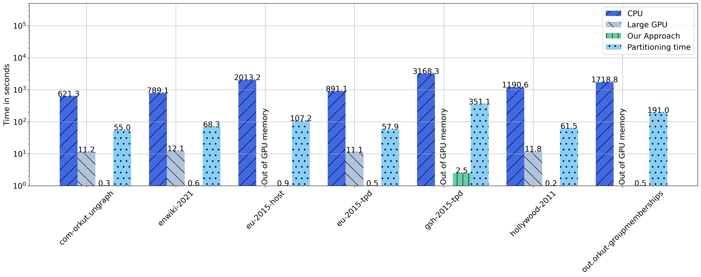

# Inference
We measure the GNN inference time of a two-layer GraphSage GNN with mean pooling on a CPU and two different GPUs for all graphs of Table IV and compare it with our approach.

We use the following hardware setups:

GPUs:
| GPU  | GPU Memory | CPU | CPU Memory | Storage |
|-------|:---------:|:----------:|:-----------:|--------------------:|
| Nvidia P100 (medium sized GPU) |  16 GB   | 2x Intel(R) Xeon(R) CPU E5-2640 v4 | 128 GB | 480 GB SATA SSD|
| Nvidia RTX8000 (large GPU)|  48 GB  | 2x AMD EPYC 7282 | 256 GB | 3.2 TB NVMe SSD |

CPU:
| CPU | CPU Memory | Storage |
|-------|:---------:|:----------:|
|  2x AMD EPYC 7282 | 256 GB | 3.2 TB NVMe SSD |


# Installation
Use [this script](quick_setup.sh) to install python dependencies such as pytorch, dgl etc.

Example how to do inference:
```bash
python code/inference_gpu.py --graph graph --out_dir code/results/gpu/graph_1
python code/inference_cpu.py --graph graph --out_dir code/results/cpu/graph_1
```

# Results
## Plot
The following plot shows the inference time (average of five runs) on a GPU, CPU and our approach for all graphs of Table IV. The y-axis is displayed on a logarithmic scale.

On the medium sized GPU we cannot perform inference at all, because we run out of GPU memory for all graphs. Therefore, we only report inference times for the large GPU. Even on the large GPU, we can only perform inference on the four smaller graphs of Table IV but run out of GPU memory for the remaining ones. This is due to the fact that for graph prediction, the whole graph must be loaded into memory of the GPU.

In the plot, OOM is the abbreviation for *out of memory*. 




## Table
The following Table shows the inference time (average of five runs) on a GPU, CPU, our approach and the partitioning time of the *slowest partitioner* for all graphs of Table IV:


| Graph                      | Device   | Inference time (seconds)   |   Slowest Partitioner Time (seconds) |
|:---------------------------|:---------|:---------------------------|-------------------------------------:|
| com-orkut.ungraph          | EASE     | 0.301                      |                               54.986 |
| com-orkut.ungraph          | GPU      | 11.165                     |                               54.986 |
| com-orkut.ungraph          | CPU      | 621.256                    |                               54.986 |
| enwiki-2021                | EASE     | 0.562                      |                               68.339 |
| enwiki-2021                | GPU      | 12.15                      |                               68.339 |
| enwiki-2021                | CPU      | 789.098                    |                               68.339 |
| eu-2015-host               | GPU      | Out-of-memory              |                              107.198 |
| eu-2015-host               | EASE     | 0.859                      |                              107.198 |
| eu-2015-host               | CPU      | 2013.245                   |                              107.198 |
| eu-2015-tpd                | CPU      | 891.066                    |                               57.908 |
| eu-2015-tpd                | GPU      | 11.116                     |                               57.908 |
| eu-2015-tpd                | EASE     | 0.501                      |                               57.908 |
| gsh-2015-tpd               | GPU      | Out-of-memory              |                              351.064 |
| gsh-2015-tpd               | EASE     | 2.46                       |                              351.064 |
| gsh-2015-tpd               | CPU      | 3168.313                   |                              351.064 |
| hollywood-2011             | EASE     | 0.197                      |                               61.525 |
| hollywood-2011             | GPU      | 11.801                     |                               61.525 |
| hollywood-2011             | CPU      | 1190.562                   |                               61.525 |
| out.orkut-groupmemberships | GPU      | Out-of-memory              |                              190.961 |
| out.orkut-groupmemberships | EASE     | 0.549                      |                              190.961 |
| out.orkut-groupmemberships | CPU      | 1718.794                   |                              190.961 |